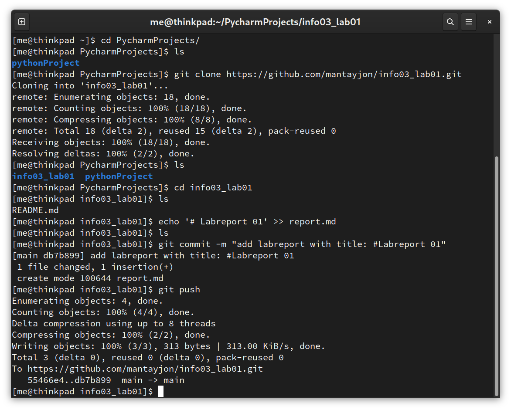
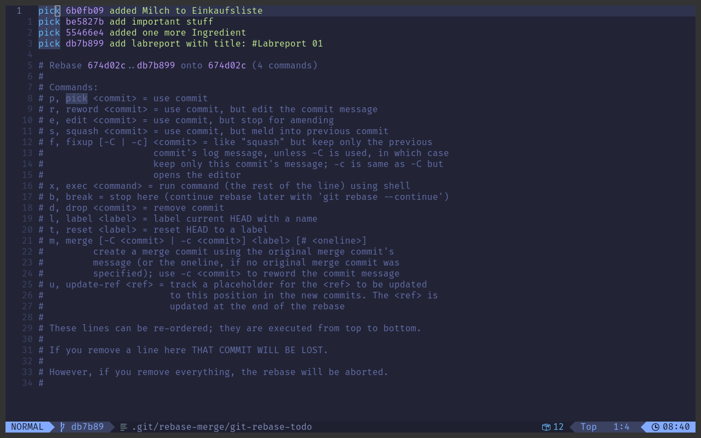

# Lab 01 – Git

Group: Tobias Bayer, Jonas Mantay, Jonas Trenkler  
Our repository: [https://github.com/mantayjon/info03_lab01](https://github.com/mantayjon/info03_lab01)

## Part 2: Set up a central GitHub repo and try out:	

We set up a GitHub repository by clicking 'new repository' on the GitHub website.
Our next step was to read the recommended instructions on the website. To create a new repository on the command line, it told us to:

1. `echo "# test" >> README.md`
    - writes '# test' into a file. If the file does not exist, it is created first.
2. `git init`
    - initializes a git repository. A hidden .git folder is created, which contains information about the repository.
3. `git add README.md`
    - git add file.extension adds a file to the staging area, ready to be committed. We could have written `git add .` to add all files in the current working directory to the commit.
4. `git commit -m "first commit"`
    - git commit -m message creates a commit with a message, e.g “add very important thing”
5. `git branch -M main`
    - git branch -M main is short for git branch -move --force main. This means that a new branch will be created as main no matter what.
6. `git remote add origin https://github.com/abductedRhino/test.git`
    - this adds a repository to pull from and push to. The name is origin.
7. `git push -u origin main`
    - this creates an upstream tracking branch and pushes it.
    
With the suggested steps, we were able to create and push a GitHub repository. We wrote a list called “Einkaufsliste” into our `README.md` and collaboratively pushed items to it. Again, we chose to use the Terminal: 

```bash
mkdir info3
cd info3
git clone https://github.com/mantayjon/info03_lab01.git
cd info03_lab01
```

1. make a new directory named 'info3'
2. change directory to 'info3'
3. copy the git repository from https://github.com/mantayjon/info03_lab01.git
4. change directory to 'info03_lab01'



To push an item to the list in `README.md`, we open the file with any text-editor and append a new list-item in Markdown syntax, e.g. `- Salz` and hit save. We then return to our Terminal:

```bash
git add .
git commit -m "add item to list"
git push
```

1. add every new or changed file in current working directory to git staging area. In this case, just `README.md`
2. create a commit with message 'add item to list'
3. push, update the remote commit with the commit we just created.

With the above, we were able to change file collaboratively, but we created conflicts while working on the same file simultaneously. 
When trying to push to the remote repository, git warned us that there is a conflict that needs to be resolved before pushing.
The same problem occurs when trying to pull the upstream branch.
The CLI gave us hints how to proceed, and we chose to pull and merge the branch locally.
This opened `vimdiff` as the default merge tool.
For someone not used to vim a GUI merge tool like VS Code might be easier to use.

The merge conflicts can be prevented by:

- working in different branches
- working on different files

This copies the remote repo, makes a file with a line of text, adds it to the staging area, creates a commit with a message and updates the remote with the local commit.
This report was created in a similar way as the `git init` above.

## When in doubt

`git status` and `git log --oneline` helped to get an overview of what is going on in the repository.
There are a lot of different options for `git log` that are worth exploring, this is just a convenient short form.
`git fetch` was needed to get the current status of the upstream repository as well, `git pull` implicitly calls that and whatever strategy for dealing with conflicts is configured.
Whenever possible the default is to just fast-forward, i.e., merge without creating a new commit. 
The other option is to merge after resolving the conflict manually.
Finally, a rebase offers the most flexibility and `git rebase -i` is an interactive way to more or less rewrite the repositories' history.
The following screenshot shows the contents of a rebase-todo, and all its options, during an interactive rebase.
If a merge conflict is detected during the rebase, it can be resolved manually and the rebase is continued with `git rebase --continue`.
Again, the CLI gave hints how to proceed.

