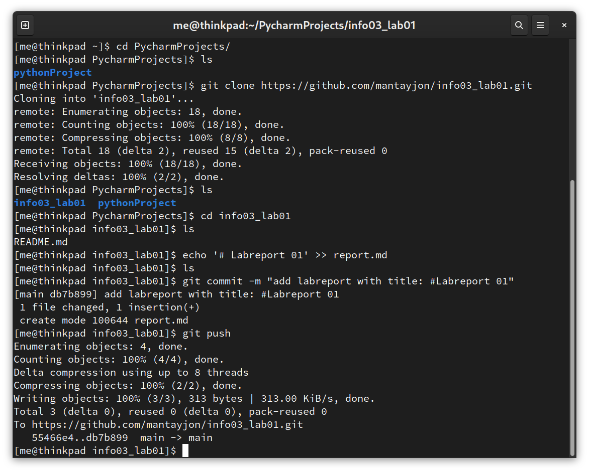

#### EURE NAMEN, Tobias Bayer, Jonas Mantay

[our repository](https://github.com/mantayjon/info03_lab01)

# Labreport 01

### Part 2: Set up a central github repo and try out:	

We set up a github repository by clicking 'new repository' on the github website.
Our next step is to read the recommended instructions on the website. To create a new repository on the command line , it tells us to:

1. `echo "# test" >> README.md`
    - writes '# test' into a file. If the file does not exist, it is created first.
2. `git init`
    - git init initialises a git repository. A hidden .git folder is created, which contains information about the repository.
3. `git add README.md`
    - git add file.extension adds a file to the staging area, ready to be commited. We could have written git add . to add all files in the current working     - directory to the commit.
4. `git commit -m "first commit"`
    - git commit -m message creates a commit with a message, e.g "add very important thing"
5. `git branch -M main`
    - git branch -M main is short for git branch -move --force main. This means that a new branch will be created as main no matter what.
6. `git remote add origin https://github.com/abductedRhino/test.git`
    - this adds a repository to pull from and push to. The name is origin.
7. `git push -u origin main`
    - this creates an upstream tracking branch and pushes it.
    
With the suggested steps, we are able to create and push a github repository. We write a list into our `README.md` and collaboratively push items to it. Again, we choose to use the Terminal: 

with `git clone` we download a copy of the repository into a local folder.

* sharing files and changes
* different workflows (see git slides)
* resolving merge conflicts
* rebasing, merging, fast-forwarding

